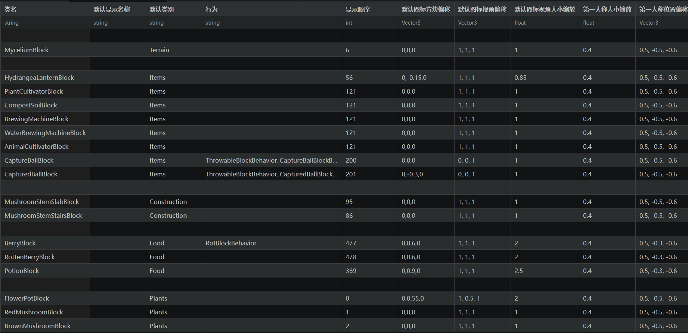

# CSV Block Editor For Survivalcraft

A VS Code extension for editing Survivalcraft mod block data files in a spreadsheet-like table view.
（一个 VS Code 扩展，用于在类似电子表格的表格视图中编辑生存战争模组方块数据文件。）

## Features（功能特点）

- **Table View Toggle**: Click the table icon in the editor title bar to switch between text view and table view
  （表格视图切换）：点击编辑器标题栏中的表格图标，在文本视图和表格视图之间切换
- **Spreadsheet Editing**: Edit cells directly, navigate with `Tab`, navigate rows with `Enter`
  （电子表格编辑）：直接编辑单元格，使用 `Tab` 键换列，使用 `Enter` 键换行
- **Chinese Field Mapping**: Column headers display Chinese names while the underlying data uses English field names
  （中文字段映射）：列标题显示中文名称，而底层数据使用英文字段名
- **Data Type Annotations**: A dedicated type row displays the data type of each column
  （数据类型标注）：专门的类型行显示每列的数据类型
- **Column Resizing**: Drag column borders in the header row to resize columns
  （列宽调整）：拖动标题行中的列边框来调整列宽
- **Real-time Sync**: Edits in table view immediately update the underlying text content
  （实时同步）：表格视图中的编辑会立即更新底层文本内容
- **Seamless Save**: Press `Ctrl+S` to save — the original `.csv` or `.txt` file is overwritten directly
  （无缝保存）：按 `Ctrl+S` 保存——直接覆盖原始的 `.csv` 或 `.txt` 文件
- **Dark Theme Optimized**: All colors use opaque values for consistent appearance in VS Code dark themes
  （深色主题优化）：所有颜色使用不透明值，在 VS Code 深色主题下显示一致

## Screenshots（截图）

## Usage（使用方法）

1. Open a `.csv` or `.txt` block data file in VS Code
   （在 VS Code 中打开 `.csv` 或 `.txt` 格式的方块数据文件）
2. Click the **table icon** in the editor title bar (top-right)
   （点击编辑器标题栏右上角的**表格图标**）
3. Edit cells in the table view
   （在表格视图中编辑单元格）
4. Press `Ctrl+S` to save changes back to the original file
   （按 `Ctrl+S` 将更改保存回原始文件）
5. Click the table icon again to switch back to text view
   （再次点击表格图标切换回文本视图）

## Supported File Format（支持的文件格式）

- Semicolon-separated values (`;`)
  （以分号（`;`）分隔的值）
- Fields containing `;`, `"`, or newlines are quoted with doubled double-quotes
  （包含 `;`、`"` 或换行符的字段使用双引号转义）
- First row: column headers (field names)
  （第一行：列标题（字段名））
- Second row: data type annotations
  （第二行：数据类型标注）
- Subsequent rows: data
  （后续行：数据）

## Requirements（系统要求）

- VS Code 1.85.0 or higher
  （VS Code 1.85.0 或更高版本）

## Extension Settings（扩展设置）

No configuration required. The extension activates automatically when VS Code starts.
（无需配置。扩展在 VS Code 启动时自动激活。）

## Known Issues（已知问题）

None.
（无。）

## Changelog（更新日志）

See [CHANGELOG.md](CHANGELOG.md) for full version history.
（查看 [CHANGELOG.md](CHANGELOG.md) 了解完整的版本历史。）

## Support & Feedback（支持与反馈）

If you encounter any issues or have suggestions, please feel free to [open an issue](https://github.com/nonameMaodie/csv-block-editor/issues).
（如果遇到问题或有建议，请随时[提交 issue](https://github.com/nonameMaodie/csv-block-editor/issues)。）

## License（许可证）

MIT
